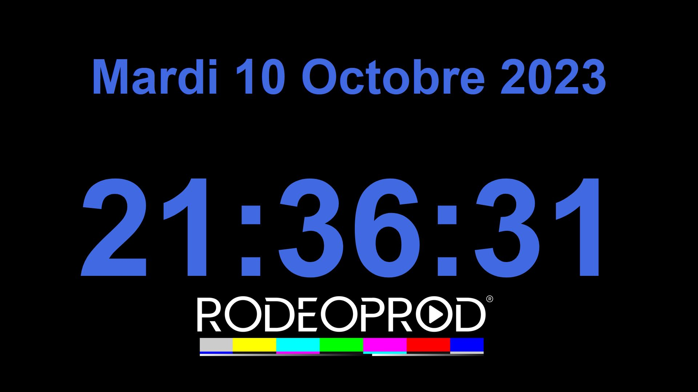
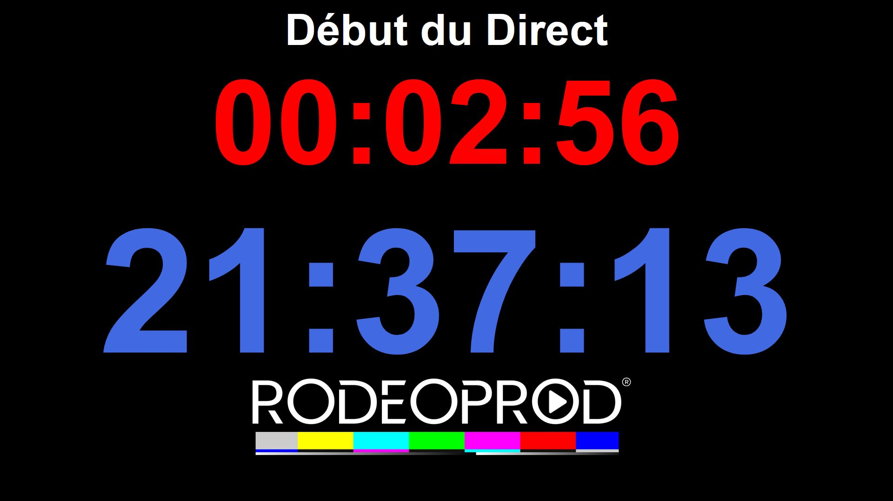
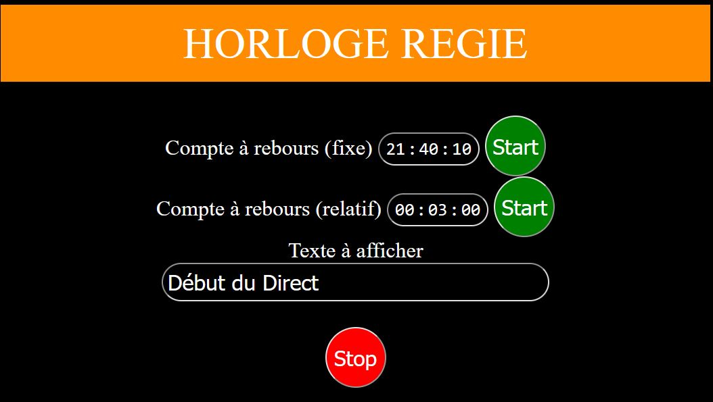

# Rodeoprod clock

## About

This project is a web page display clock with a remote controled countdown.

The display page can be hosted on a simple raspberry starting Firefox in mode kiosk

To simplify tests and distribution the project come with a docker compose configuration

## Prerequisites

This project need :
- A web server to host the display and control page
- A websocket server running on nodejs

If you would like more details about it you can check the file :
- [apache/Dockerfile](./apache/Dockerfile) (For webserver)
- [nodejs/Dockerfile](./nodejs/Dockerfile) (For websocket on nodejs)

## Quick start

- You should git clone this repository
- Edit the .env file with the path of your project
- Edit the docker-compose file
- Start the project `docker-compose up -d`

Clock display is available at : http://127.0.0.1/clockDisplay.html

Clock control is available at : http://127.0.0.1/clockControl.html

## Displaying the clock

The display clock can be auto start on a raspberry by adding this line in cron

>echo "@reboot pi firefox -kiosk http//127.0.0.1/clockDisplay.html" > /etc/cron.d/clock-display

Adjust the URL with your web server IP if needed

